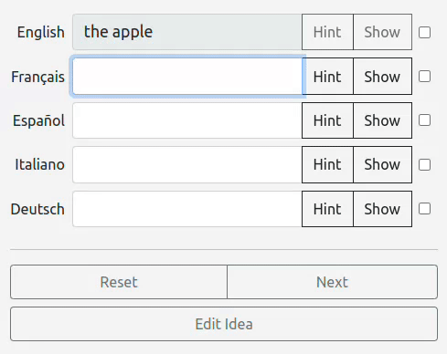

# 

Babilonia is an innovative tool for language enthusiasts who want to **expand their vocabulary** and **reinforce their memory** of foreign languages. It seeks to unlock the power of vocabulary as a means to express your thoughts and understand languages. As your vocabulary improves, so do your language skills!

Babilonia helps you learn **more words**, **faster**. Also, unlike traditional methods, Babilonia lets you practice multiple languages **at the same time**! 😍

## Features
- Enables you to memorize a **maximum** amount of words in a **minimum** amount of time ⏳
- Leverages **muscle memory** and **visual memory** as a mental boost 🧠
- Contains clever tricks to help you remember words **as you're typing** 💡
- Builds on top of **partial knowledge** of words 📚
- Tracks **how many words** you know in each language 📈
- Allows you to focus on words you haven't mastered yet for **personalized** learning 🎯
- Uses a novel method based on **universal ideas** ♾️
- Lets you practice any set of languages **all at once**! 🤯

## Powerful, targeted help

Learning works best when it's **interactive**. Babilonia works with what you know and builds up from there. It gives you **instant feedback** as you're practicing and **helpful hints** when you need them. In other words, it's like your own personal teacher!

As you're typing, Babilonia **highlights** your answer in **red** or **green** to let you know if you're on the right track. By **steering you in the right direction**, you assimilate information more easily. In fact, as *you* are the one who types the correct answer, it becomes part of your **muscle memory**.

Babilonia's approach is to help you remember **on your own**. Often, even if you don't recall a word, you still remember **parts of it**. It may be its first letter, its ending, or how it sounds. If you **get a hint**, the memory may well spring back to your mind. There's a good reason for the idiom "it's on the tip of my tongue"!

Instead of revealing **the entire word**, which would prevent you from remembering it by yourself, Babilonia gives you **the next letter**. Going from getting a hint, to typing what you know, to getting another hint is much more **interactive** and **fun**. Most importantly, this way of practicing makes you significantly **more likely to remember** more parts of the word the next time.

That is why we say that Babilonia rewards and builds upon **partial knowledge**. If you know *some* letters in a word, you can still get it partially correct. **Remembering more letters means progress**, even if you don't recall the entire word. That is very motivating, and it also lets you focus more on the letters that you actually didn't get right.

Of course, sometimes, you simply don't know. No need to go through hints then: you can get **the complete word**. After all, you do have to start somewhere!

### A GIF is worth a thousand words

## A polyglot's paradise
Babilonia lets you practice **any number of languages at the same time**. Most language learning tools only allow you to practice one language at a time. But what if you want to master *multiple* languages? It would be incredibly convenient to practice them at the same time, right? Babilonia enables you to do just that!

That comes with many benefits. For one, you get to exercise the **mental gymnastics** of quickly **switching between languages**,
which is an invaluable skill for a polyglot to have. Also, you learn to **associate between them** the words in different languages to convey the same idea, which helps you remember them more easily. Plus, it's an incredibly **efficient way** to practice when you want to learn multiple languages.

Of course, even though you *could* practice tons of languages at the same time, it doesn't mean you *have* to! You can always choose which languages you would like to study. It could be one, two or any combination of languages. Flexibility is key.

## Personalized learning
**Mark expressions as "known"** as you encounter them. Doing so allows you to get **personalized learning**, as you can tell Babilonia to make you practice only **words that you have not yet mastered**. That means you can focus on practicing what you actually need to learn and not repeat words you have already acquired.

## Track your progress
Another benefit of marking expressions as "known" is that Babilonia can **track your progress** and show you **statistics** on how many words you have learned. Tracking your progress is key for **staying motivated** because you can see how much you have improved.

Seeing those numbers go up is, on its own, **a worthwhile goal** to pursue. It is also an **excellent measure** of your progress in any language and helps you compare which languages you know better than others and **where to direct your efforts**.

## Ideas and expressions
Two interesting and helpful concepts that Babilonia uses are `ideas` and `expressions`. They are very simple yet powerful notions.

### Ideas are universal
The concept of ideas is that words in one language are **grouped** with words in other languages **that express the same idea**.

While dictionaries organize vocabulary **by words**, Babilonia organizes vocabulary **by ideas**. There are as many ideas as there are **meanings** for a word.

For example, in English, you `play` music like you `play` a sport. Spanish conveys those two meanings with two different words: `tocar` and `jugar`. While an English-Spanish dictionary would list those two words under `to play`, Babilonia views them as **two separate ideas**. Learners practice them separately as they *are* two distinct entities.

That's because, in Babilonia, **no language is the single point of reference**. Every language has its quirks, similarities and differences. Thus, practicing multiple languages at the same time requires a **universal system**. In Babilonia, that system is the concept of `ideas`.

### Expressions are more than words
Often, an expression is simply a **word**, like `beer`, `cold`, `very`, or `to drink`.

But it could also be **a phrase**, **an expression**, **an idiom**, **a saying**, or **any other useful sentence**. For example, these are all expressions:
- `how are you?`
- `what's your name?`
- `watch out!`
- `the cost of living`
- `it's raining cats and dogs`

Expressions are the **actual language elements** that you type and practice in Babilonia.

## Simplified keyboard input
When simultaneously practicing multiple languages that use **different alphabets**, typing the **right letter** with the **correct accent**
in **every word** of **every language** can be impractical and add friction to your learning. Not only does that require you to change your keyboard settings a lot, but also to learn what specific combination of keys on your keyboard allows you to type each letter and accent.

That can add a lot of friction to your learning. Sure, mastering spelling *is* important, but if your goal is to practice as many words as possible, getting each accent right might not be your priority. Furthermore, many people find it valuable to first learn a new language without the **added difficulty of accents**.

To help with this, Babilonia allows you to disable "strict mode," which allows you to type the **unaccented form** of a letter instead of its accented form. This feature can save you **time and effort**, especially if your goal is to practice **as many words as possible**. Please note that this feature currently
only supports languages using the Latin alphabet, but future releases will include ways to enable it for more scripts.

## Use included vocabulary or add your own
As of version 2.1, the application comes with a set of **2751 expressions** and **518 ideas** in **5 languages**: English, French, German, Spanish and Italian. **More get added** over time.

You can also easily **add your own** expressions, ideas and languages. You can then **practice them** just like the included vocabulary. This feature is especially useful if you want to **practice a language that is not included** in the default vocabulary or if you want to **add your own words** to practice.

Also, while modifying and deleting included words is possible, it comes with implications for future updates. Included vocabulary may change with each release, potentially overwriting your modifications. However, any new content you add will remain unaffected. In any case, make sure to always back up your data before updating the application.

## An important caveat
**Vocabulary** is only **one part** of language learning. That's why Babilonia does not seek to be the be-all and end-all of language learning tools. *Nothing is*. Learning languages requires a **variety of sources**. However, we believe that acquiring vocabulary
is the single most important aspect of learning languages, which unlocks a world of possibilities.

## How to use

### Prerequisites

Make sure you have `Node.js` installed on your machine. Go to [nodejs.org](https://nodejs.org/) to download and install the latest version.

### Installation steps

1. Install [`Node.js`](https://nodejs.org/) if you haven't already.
2. Download the [latest release](https://github.com/emilepharand/Babilonia/releases) of Babilonia.
3. Extract the archive.
4. Open a terminal and navigate to the extracted folder.
5. Run `npm install`.
6. You can now use the application!

### Running Babilonia

Once you have installed Babilonia, you can run it by following these steps:

1. Start the application by running `node index.cjs` or `npm start`.
2. Open your web browser and navigate to `localhost:8000`.

That's it! You're now ready to use Babilonia. If you encounter any issues, make sure to check the project's documentation or report them on GitHub.

The database is a SQLite file called `db.db`. It is created automatically if it does not exist. If you want to start with a fresh database, simply delete the `db.db` file and restart the application.

## License

This project is licensed under the terms of the [MIT License](https://opensource.org/licenses/MIT).

## Can I contribute?

Of course! Feel free to open an issue or make a pull request.

 
 
People often say that motivation doesn't last. Well, neither does bathing — that's why we recommend it daily. - Zig Ziglar
